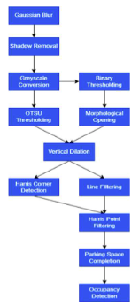
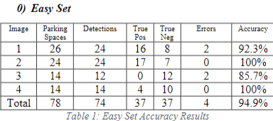
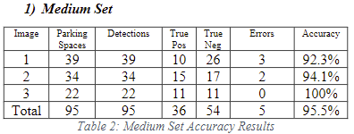
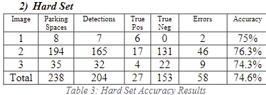
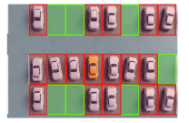
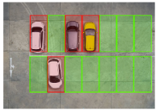
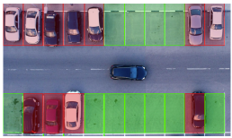
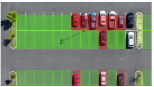
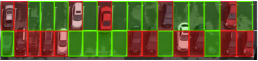

# ParkingSpaceClassificationAndDetection
Parking Space Detection and Classification using Classical Image Processing Techniques

Parking space occupancy detection is a tool that plays a significant role in urban 
management systems. Legacy approaches to this task have traditionally used either
physical (Ultrasonic/Magnetic etc.) sensors placed on the ceiling or floor of a 
parking space or a ticketing system to track the number of cars in a car park. 
However, due to recent developments, the prominence of lightweight image processing 
techniques, as well as deep learning approaches, have emerged as potential alternatives.

A project completed in 2 weeks alongside 6 other topics in my MSc AI course.

Overall accuracy of ≈ 88% achieved over the easy, medium and hard sets.

### Perfect Results

     

### Imperfect Results

   

